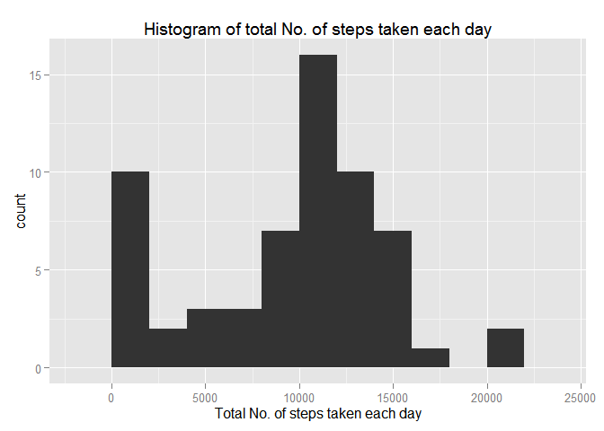
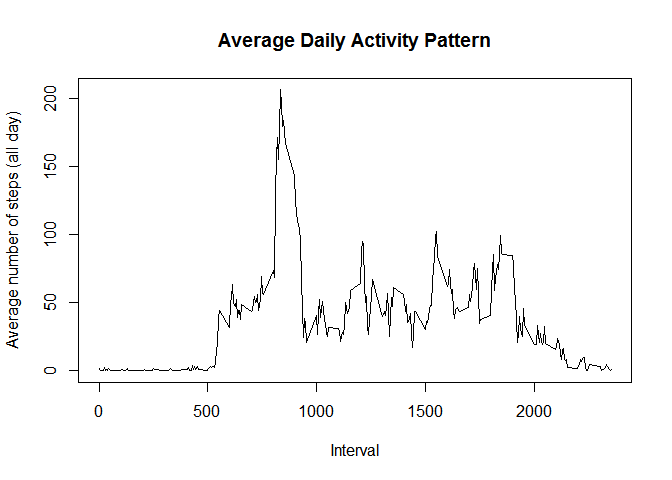
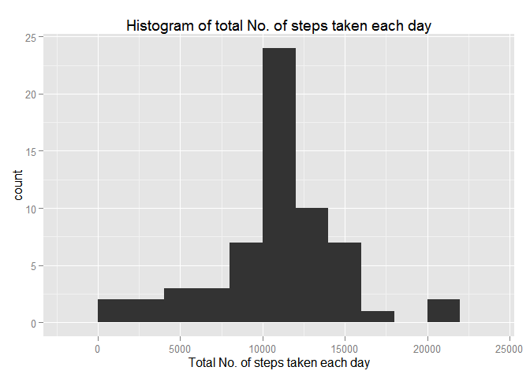
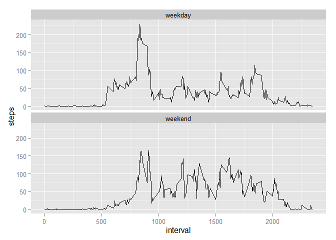

# Reproducible Research: Peer Assessment 1

Prerequisites:
  Step 1: Download and UnZip Activity.ZIP
  Step 2: Install packages ggplot2

## Loading and preprocessing the data


```r
data <- read.csv("activity.csv")
summary(data)
```

```
##      steps                date          interval     
##  Min.   :  0.00   2012-10-01:  288   Min.   :   0.0  
##  1st Qu.:  0.00   2012-10-02:  288   1st Qu.: 588.8  
##  Median :  0.00   2012-10-03:  288   Median :1177.5  
##  Mean   : 37.38   2012-10-04:  288   Mean   :1177.5  
##  3rd Qu.: 12.00   2012-10-05:  288   3rd Qu.:1766.2  
##  Max.   :806.00   2012-10-06:  288   Max.   :2355.0  
##  NA's   :2304     (Other)   :15840
```

```r
head(data)
```

```
##   steps       date interval
## 1    NA 2012-10-01        0
## 2    NA 2012-10-01        5
## 3    NA 2012-10-01       10
## 4    NA 2012-10-01       15
## 5    NA 2012-10-01       20
## 6    NA 2012-10-01       25
```


## What is mean total number of steps taken per day?

```r
library(ggplot2)
totalNumberOfSteps <- tapply(data$steps, data$date, FUN=sum, na.rm=TRUE)
qplot(totalNumberOfSteps, xlab="Total No. of steps taken each day", main="Histogram of total No. of steps taken each day" , binwidth=2000 )
```

 

```r
mean(totalNumberOfSteps, na.rm=TRUE)
```

```
## [1] 9354.23
```

```r
median(totalNumberOfSteps, na.rm=TRUE)
```

```
## [1] 10395
```


## What is the average daily activity pattern?
- Make a time series plot (i.e. type = "l") of the 5-minute interval (x-axis) and the average number of steps taken, averaged across all days (y-axis)


```r
avgIntervalSteps_df <- aggregate(steps ~ interval, data, mean)

plot(avgIntervalSteps_df$interval, avgIntervalSteps_df$steps, type='l', col=1, 
     main="Average Daily Activity Pattern", xlab="Interval", 
     ylab="Average number of steps (all day)")
```

 

- Which 5-minute interval, on average across all the days in the dataset, contains the maximum number of steps?


```r
avgIntervalSteps_df[which.max(avgIntervalSteps_df$steps),]
```

```
##     interval    steps
## 104      835 206.1698
```

## Imputing missing values

- Calculate and report the total number of missing values in the dataset (i.e. the total number of rows with NAs)


```r
totalNumberOfMissingSteps <- sum(is.na(data))
totalNumberOfMissingSteps
```

```
## [1] 2304
```

- Devise a strategy for filling in all of the missing values in the dataset. The strategy does not need to be sophisticated. For example, you could use the mean/median for that day, or the mean for that 5-minute interval, etc.


```r
newdataset <- data
for (i in 1:length(newdataset$steps)) {
    if (is.na(newdataset[i, 1])) {
        
        steps_average <- subset(avgIntervalSteps_df, avgIntervalSteps_df$interval == as.numeric(data[i, 
            3]))$steps
        
        ## Replaces the value
        newdataset[i, 1] <- steps_average
    } else {
        newdataset[i, 1] <- newdataset[i, 1]
    }
    newdataset
}
```


- Create a new dataset that is equal to the original dataset but with the missing data filled in.


```r
head(newdataset)
```

```
##       steps       date interval
## 1 1.7169811 2012-10-01        0
## 2 0.3396226 2012-10-01        5
## 3 0.1320755 2012-10-01       10
## 4 0.1509434 2012-10-01       15
## 5 0.0754717 2012-10-01       20
## 6 2.0943396 2012-10-01       25
```

```r
summary(newdataset)
```

```
##      steps                date          interval     
##  Min.   :  0.00   2012-10-01:  288   Min.   :   0.0  
##  1st Qu.:  0.00   2012-10-02:  288   1st Qu.: 588.8  
##  Median :  0.00   2012-10-03:  288   Median :1177.5  
##  Mean   : 37.38   2012-10-04:  288   Mean   :1177.5  
##  3rd Qu.: 27.00   2012-10-05:  288   3rd Qu.:1766.2  
##  Max.   :806.00   2012-10-06:  288   Max.   :2355.0  
##                   (Other)   :15840
```

- Make a histogram of the total number of steps taken each day and Calculate and report the mean and median total number of steps taken per day. Do these values differ from the estimates from the first part of the assignment? What is the impact of imputing missing data on the estimates of the total daily number of steps?


```r
library(ggplot2)
totalNumberOfStepsnew <- tapply(newdataset$steps, newdataset$date, FUN=sum)
qplot(totalNumberOfStepsnew, xlab="Total No. of steps taken each day", main="Histogram of total No. of steps taken each day" , binwidth=2000 )
```

 

```r
mean(totalNumberOfStepsnew)
```

```
## [1] 10766.19
```

```r
median(totalNumberOfStepsnew)
```

```
## [1] 10766.19
```


## Are there differences in activity patterns between weekdays and weekends?
-Create a new factor variable in the dataset with two levels – “weekday” and “weekend” indicating whether a given date is a weekday or weekend day.


```r
weekday.or.weekend <- function(date) {
    day <- weekdays(date)
    if (day %in% c("Monday", "Tuesday", "Wednesday", "Thursday", "Friday"))
        return("weekday")
    else if (day %in% c("Saturday", "Sunday"))
        return("weekend")
    else
        stop("invalid date")
}
newdataset$date <- as.Date(newdataset$date)
newdataset$day <- sapply(newdataset$date, FUN=weekday.or.weekend)
```

-Make a panel plot containing a time series plot (i.e. type = "l") of the 5-minute interval (x-axis) and the average number of steps taken, averaged across all weekday days or weekend days (y-axis). See the README file in the GitHub repository to see an example of what this plot should look like using simulated data.


```r
library(ggplot2)
averages <- aggregate(steps ~ interval + day, data=newdataset, mean)
names(averages) <- c("interval", "day", "steps")
ggplot(averages, aes(interval, steps)) + geom_line() + 
    facet_wrap(~day, ncol = 1)
```

 
